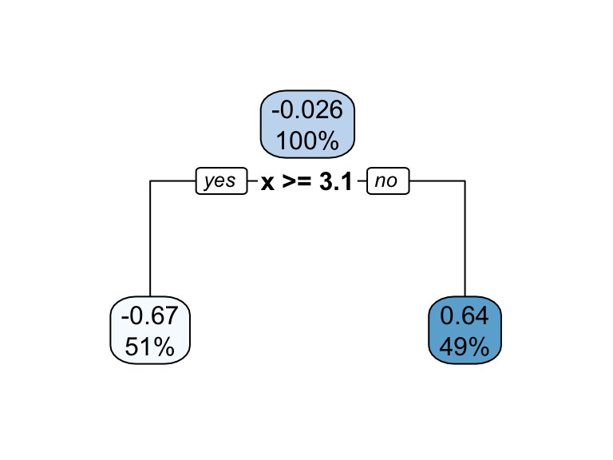
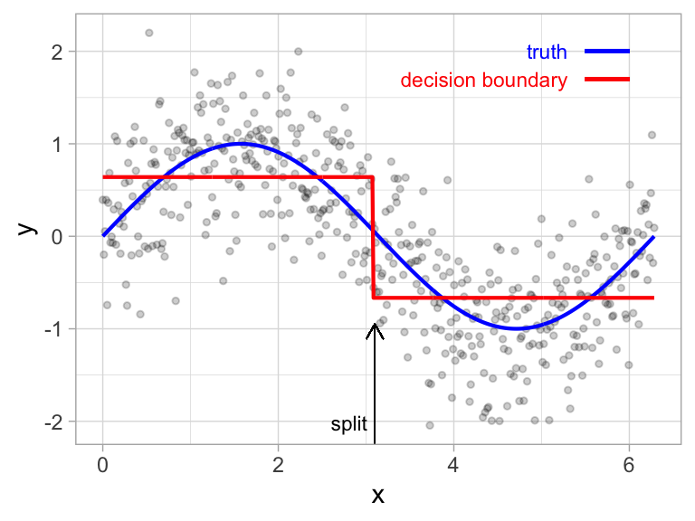

## Computational Set-Up

```{r}
library(tidyverse)
library(tidymodels)
library(dsbox) # dcbikeshare data
library(knitr)

tidymodels_prefer()

set.seed(427)
```


## Tree-Based Methods {.smaller}

-   Idea: **stratify** or **segment** the predictor space into simple regions
-   Splitting rules used to segment the predictor space form a tree
-   Can be used for both classification and regression
-   Single tree called **decision tree**
    +   Simple and useful for interpretation
    +   Not the best in terms of prediction accuracy.
-   Much more powerful: grow multiple trees and then combine their results
    +   **bagging** and **boosting** .
-   Most powerful methods for tabular data are typically tree-based methods

## Terminology for Trees

-   Every split is considered to be a **node**
-   First node at the top of the tree: **root node** (contains all the training data)
-   Final nodes at the bottom of tree called **leaves** or **terminal nodes**
-   Decision trees typically drawn with root at top and leaves at bottom
-   Nodes in middle of tree called **internal nodes**
-   The segments of the trees that connect nodes are known as **branches**


## Terminology for Trees

::: {#fig-tree1 layout-ncol=2}


From Hands-On Machine Learning, Boehmke & Greenwell
:::


## Building a Tree {.smaller}

-   Select predictor $X_j$ and cut point $s$ such that splitting the predictor space into the regions
$\{X|X_j < s\}$ and $\{X|X_j \geq s\}$ leads to the greatest possible reduction in performance metric (e.g. SSE)
-   For any $j$ and $s$, define
$$R_1 = \{X|X_j < s\} \ \ \text{and} \ \ R_2 = \{X|X_j \geq s\}$$
-   Find $j$ and $s$ that minimize
$$SSE = \displaystyle \sum_{i \in R_1}\left(y_i - \hat{y}_{R_1}\right)^2 + \sum_{i \in R_2}\left(y_i - \hat{y}_{R_2}\right)^2$$
-   Repeat process on each the two new regions
-   Continue until a stopping criterion is reached


## Prediction

-   For new observation that falls in region $R_j$:
    +   Regression: the mean response of the training set observations in $R_j$
    +   Classificaiton: majority vote response of the training set observations in $R_j$


## Building a Tree and Prediction

::: {#fig-tree2 layout-ncol=2}





From Hands-On Machine Learning, Boehmke & Greenwell
:::


## Building a Tree and Prediction

::: {#fig-tree3 layout-ncol=2}


From Hands-On Machine Learning, Boehmke & Greenwell
:::


## Building a Tree and Prediction


## Building a Tree {.smaller}

-   Anyone know what a **greedy algorithm** is?

. . .

-   Computationally infeasible to consider every possible partition
-   Idea: **top-down, greedy** approach known as **recursive binary splitting**.
    +   **top-down** because it begins at the top of the tree
    +   **greedy** because at each step of the tree-building process, the best split is made at that particular step, rather than looking ahead and picking a split that will lead to a better tree in some future step
        +   Important for determining whether to use a ordinal encoding or not
    +   Stop when each terminal node has fewer than some predetermined number of observations
    
## Overfitting

-   This process described above is likely to **overfit** the data
-   One solution: require each split to improve performance by some amount
    +   Bad Idea: sometimes seemingly meaningless cuts early on enable really good cuts later on
-   Good solution: **pruning**
    +   Build big tree and the prune off branches that are unnecessary
    
## Tree Pruning


## Bias-Variance Trade-Off

-   How does the bias-variance trade-off relate to the bias-variance trade-off?
    +   Would larger trees have high or lower bias?
    +   What about variance?


## Tree Pruning

-   Grow a very large tree, and then **prune** it back to obtain a **subtree**.
-   Terminology: **cost complexity pruning** or **weakest link pruning**
-   Consider the following objective function $$SSE(T) + \alpha \times |T| = SSE(T) = \alpha \times (\text{# of terminal nodes of }T)$$
-   How should we choose $\alpha$? [Cross Validation]{.fragment}

# Regression Trees in R

## Data: `dcbikeshare` {.smaller}

Bike sharing systems are new generation of traditional bike rentals where whole process from membership, rental and return back has become automatic. Through these systems, user is able to easily rent a bike from a particular position and return back at another position. As of May 2018, there are about over 1600 bike-sharing programs around the world, providing more than 18 million bicycles for public use. Today, there exists great interest in these systems due to their important role in traffic, environmental and health issues. [Documentation](https://www.kaggle.com/datasets/marklvl/bike-sharing-dataset)

```{r}
glimpse(dcbikeshare)
```

## Cleaning the Data

```{r}
dcbikeshare_clean <- dcbikeshare |> 
  select(-instant, -dteday, -casual, -registered, -yr) |> 
  mutate(
    season = as_factor(case_when(
      season == 1 ~ "winter",
      season == 2 ~ "spring",
      season == 3 ~ "summer",
      season == 4 ~ "fall"
    )),
    mnth = as_factor(mnth),
    weekday = as_factor(weekday),
    weathersit = as_factor(weathersit)
  )
```

## Split the Data

```{r}
set.seed(427)

bike_split <- initial_split(dcbikeshare_clean, prop = 0.7, strata = cnt)
bike_train <- training(bike_split)
bike_test <- testing(bike_split)
```


## Recipe

```{r}
bike_recipe <- recipe(cnt ~ ., data = bike_train) |>   # set up recipe
  step_integer(season, mnth, weekday) |>   # numeric conversion of levels of the predictors
  step_dummy(all_nominal(), one_hot = TRUE)  # one-hot/dummy encode nominal categorical predictors
```

## Define Model Workflow

```{r}
dec_tree_lowcc <- decision_tree(cost_complexity = 10^(-4)) |> 
  set_engine("rpart") |> 
  set_mode("regression")

dec_tree_highcc <- decision_tree(cost_complexity = 0.1) |> 
  set_engine("rpart") |> 
  set_mode("regression")
```

## Visualize

```{r}
library(rpart.plot)
workflow() |> 
  add_recipe(bike_recipe) |> 
  add_model(dec_tree_lowcc) |> 
  fit(bike_train) |>
  extract_fit_engine() |> 
  rpart.plot()
```


## Visualize

```{r}
library(rpart.plot)
workflow() |> 
  add_recipe(bike_recipe) |> 
  add_model(dec_tree_highcc) |> 
  fit(bike_train) |>
  extract_fit_engine() |> 
  rpart.plot()
```


## Defin Model Workflow with Tuning

```{r}
dec_tree <- decision_tree(cost_complexity = tune()) |> 
  set_engine("rpart") |> 
  set_mode("regression")

dt_wf <- workflow() |> 
  add_recipe(bike_recipe) |> 
  add_model(dec_tree)
```

## Define Folds and Tuning Grid

```{r}
bike_folds <- vfold_cv(bike_train, v = 5, repeats = 10)

cp_grid <- grid_regular(cost_complexity(range = c(-4, -1)), # I had to play around with these 
                             levels = 20)
```

## Tuning CP

```{r}
tuning_cp_results <- tune_grid(
  dt_wf,
  resamples= bike_folds,
  grid = cp_grid
)
```

## Plot Results

```{r}
autoplot(tuning_cp_results)
```

## Select Best Trees

:::: columns
::: column
```{r}
best_tree <- select_best(tuning_cp_results)
best_tree |> kable()
```
:::

::: column
```{r}
ose_tree <- select_by_one_std_err(tuning_cp_results, desc(cost_complexity))
ose_tree |> kable()
```
:::
::::

## Fit Best Tree


```{r}
best_tree <- select_best(tuning_cp_results)
best_wf <- finalize_workflow(dt_wf, best_tree)
best_model <- best_wf |> fit(bike_train)
best_model |> 
  extract_fit_engine() |> 
  rpart.plot()
```

## Fit OSE Tree


```{r}
ose_tree <- select_best(tuning_cp_results)
ose_wf <- finalize_workflow(dt_wf, ose_tree)
ose_model <- ose_wf |> fit(bike_train)
ose_model |> 
  extract_fit_engine() |> 
  rpart.plot()
```

## Questions

-   Why are both models the same but have different RMSE estimates from CV?
-   What's the difference between encoding `mnth` as an ordinal variable vs. a one-hot encoding?