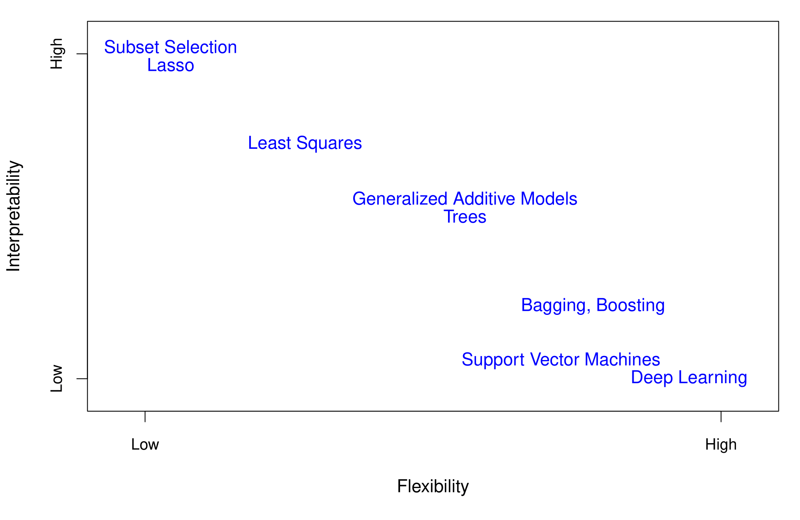
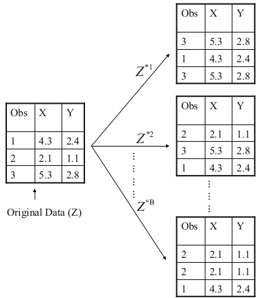

## Computational Set-Up

```{r}
library(tidyverse)
library(tidymodels)
library(rpart.plot)
library(knitr)
library(kableExtra)

tidymodels_prefer()

set.seed(427)
```


## Ensemble Methods

-   Single regression or classification trees usually have poor predictive performance.
-   **Ensemble Methods**: use a collection of models (in this case, decision trees) to improve the predictive performance
    -   Downside: Interpretability
-   Today:
    -   Bagging
    -   Random Forests
    -   Boosting
    
## Flexibility vs. Interpretability



## Bagging {.smaller}

-   **Bootstrap aggregation** or **bagging** is a general-purpose procedure for reducing the variance of a statistical learning method.
-   **Idea**: Build multiple trees and average their results.
-   **Result**: Given a set of $n$ independent observations (random variables) $Z_1, \ldots, Z_n$, each with variance $\sigma^2$, the variance of the mean/average $\bar{Z} = \displaystyle \dfrac{Z_1 + Z_2 + \cdots + Z_n}{n}$ of the observations is $\sigma^2/n$.
    +   In other words, **averaging a set of observations reduces variance**.
-   In reality, we do not have multiple training datasets.


## Bootstrapping {.smaller}



## Bagging {.smaller}

-   Take repeated bootstrap samples (say $B$) from the original dataset.
-   Build tree on each bootstrap sample and obtain predictions $\hat{f}^{*b}(x), \ b=1, 2, \ldots, B$.
-   Average all the predictions: $$\hat{f}_{\text{bag}}(x) = \frac{1}{B}\sum_{i=1}^B\hat{f}^{*b}(x)$$
-   Trees not pruned: They have high variance, but low bias.
-   Classification: **majority vote** the overall prediction is the most commonly occurring class among the $B$ predictions


## Out-of-Bag Error Estimation {.smaller}

-   Bagging $\Rightarrow$ fitting lots of models $\Rightarrow$ computationally taxing
-   Bagging + Cross-validation $\Rightarrow$ EXTREMELY COMPUTATIONALLY TAXING
-   On average, each bagged tree (constructed on each bootstrap sample) makes use of around two-thirds of the observations.
-   Remaining third observations referred to as **out-of-bag (OOB)** observations
-   For $i^{th}$ observation, use the trees in which that observation was OOB. This will yield around $B/3$ predictions for the $i^{th}$ observation. Take their average to obtain a single prediction
-   Equivalent to LOOCV if $B$ is large


## Variable Importance Measures

-   Bagging improves prediction accuracy at expense of interpretability
-   Can still obtain overall summary of importance of each predictor
    -   Reduction in the loss function (e.g., SSE) attributed to each variable at each split is tabulated
    -   A single variable could be used multiple times in a tree
    -   Total reduction in the loss function across all splits by a variable are summed up and used as the total feature importance
    -   A large value indicates an important predictor.
    
# Bagging Implementation in R

## Data: Voter Frequency

-   [Info about data](https://github.com/fivethirtyeight/data/tree/master/non-voters)
-   Goal: Identify individuals who are unlikely to vote to help organization target "get out the vote" effort.

```{r}
voter_data <- read_csv('https://raw.githubusercontent.com/fivethirtyeight/data/master/non-voters/nonvoters_data.csv')

voter_clean <- voter_data |> 
  select(-RespId, -weight, -Q1) |>
  mutate(
    educ = factor(educ, levels = c("High school or less", "Some college", "College")),
    income_cat = factor(income_cat, levels = c("Less than $40k", "$40-75k ",
                                               "$75-125k", "$125k or more")),
    voter_category = factor(voter_category, levels = c("rarely/never", "sporadic", "always"))
  ) |> 
  filter(Q22 != 5 | is.na(Q22)) |> 
  mutate(Q22 = as_factor(Q22),
         Q22 = if_else(is.na(Q22), "Not Asked", Q22),
         across(Q28_1:Q28_8, ~if_else(.x == -1, 0, .x)),
         across(Q28_1:Q28_8, ~ as_factor(.x)),
         across(Q28_1:Q28_8, ~if_else(is.na(.x) , "Not Asked", .x)),
         across(Q29_1:Q29_10, ~if_else(.x == -1, 0, .x)),
         across(Q29_1:Q29_10, ~ as_factor(.x)),
         across(Q29_1:Q29_8, ~if_else(is.na(.x) , "Not Asked", .x)),
        Party_ID = as_factor(case_when(
          Q31 == 1 ~ "Strong Republican",
          Q31 == 2 ~ "Republican",
          Q32 == 1  ~ "Strong Democrat",
          Q32 == 2 ~ "Democrat",
          Q33 == 1 ~ "Lean Republican",
          Q33 == 2 ~ "Lean Democrat",
          TRUE ~ "Other"
        )),
        Party_ID = factor(Party_ID, levels =c("Strong Republican", "Republican", "Lean Republican",
                                                "Other", "Lean Democrat", "Democrat", "Strong Democrat")),
        across(!ppage, ~as_factor(if_else(.x == -1, NA, .x))))
```

## Split Data

```{r}
set.seed(427)

voter_splits <- initial_split(voter_clean, prop = 0.7, strata = voter_category)
voter_train <- training(voter_splits)
voter_test <- testing(voter_splits)
```

## Define Model

-   `trees`: kind of a tuning parameter... want to select value that is large enough but doesn't matter past that

```{r}
bagged_model <- rand_forest(trees = 500, mtry = .cols()) |> 
  set_engine("ranger", importance = "impurity") |> 
  set_mode("classification")
```

## Define Recipe

```{r}
bag_recipe <- recipe(voter_category ~ . , data = voter_train) |> 
  step_indicate_na(all_predictors()) |> 
  step_zv(all_predictors()) |> 
  step_integer(educ, income_cat, Party_ID, Q2_2:Q4_6, Q6, Q8_1:Q9_4, Q14:Q17_4,
               Q25:Q26) |> 
  step_impute_median(all_numeric_predictors()) |> 
  step_impute_mode(all_nominal_predictors()) |> 
  step_dummy(all_nominal_predictors(), one_hot = TRUE)
  
```

## Define Workflow and Fit

```{r}
# need to install ranger
bag_wf <- workflow() |> 
  add_model(bagged_model) |> 
  add_recipe(bag_recipe)

bagged_model <- bag_wf |> 
  fit(voter_train)
```

## Evaluate performance

```{r}
voter_test <- voter_test |> 
  bind_cols(
    predict(bagged_model, voter_test, type = "class")
  )

accuracy(voter_test, truth = voter_category, estimate = .pred_class)
```


<!-- ## Bagging: Disadvantages -->

<!-- * Bagging improves the prediction accuracy for high variance (and low bias) models at the expense of interpretability and computational speed. -->

<!-- * However, although the model building steps are independent, the trees in bagging are not completely independent of each other since all the original features are considered at every split of every tree. Rather, trees from different bootstrap samples typically have similar structure to each other (especially at the top of the tree) due to any underlying strong relationships. -->

<!-- * This characteristic is known as **tree correlation** and prevents bagging from further reducing the variance of the individual models. **Random forests** extend and improve upon bagged decision trees by reducing this correlation and thereby improving the accuracy of the overall ensemble. -->


<!-- ## Bagging: Disadvantages -->

<!-- **Tree Correlation in Bagging** -->

<!-- ```{r , echo=FALSE,  fig.align='center', fig.cap="Adapted from HMLR, Boehmke & Greenwell", out.width = '100%'} -->
<!-- knitr::include_graphics("EFT/tcBagging.jpg") -->
<!-- ``` -->


<!-- ## Random Forests -->

<!-- * Provide an improvement over bagged trees by reducing the variance further (by **decorrelating**) when we average the trees. -->

<!-- * As in bagging, we build a number of decision trees on bootstrapped training samples. -->

<!-- * For each tree, each time a split is considered, a **random selection of $m$ predictors** is chosen (split candidates) from the full set of $p$ predictors. The split is allowed to use only one of those $m$ predictors. Note that in bagging, each split for each tree considers all $p$ predictors as split candidates. -->

<!-- * A fresh sample of $m$ predictors is taken at each split. Typical default values are $m = p/3$ (regression) and $m = \sqrt{p}$ (classification) but this should be considered a tuning parameter, to be chosen by CV. -->


<!-- ## Random Forests: Implementation  {.smaller} -->

<!-- **Ames Housing Dataset** -->

<!-- ```{r, echo=FALSE} -->
<!-- ames <- readRDS("AmesHousing.rds")   # load dataset -->
<!-- ``` -->

<!-- ```{r, echo=FALSE} -->
<!-- # reorder levels of 'Overall_Qual' -->
<!-- ames$Overall_Qual <- factor(ames$Overall_Qual, levels = c("Very_Poor", "Poor", "Fair", "Below_Average",  -->
<!--                                                           "Average", "Above_Average", "Good", "Very_Good",  -->
<!--                                                           "Excellent", "Very_Excellent")) -->
<!-- ``` -->

<!-- ```{r, echo=FALSE} -->
<!-- # split data -->

<!-- set.seed(051424)   # set seed -->

<!-- index <- createDataPartition(y = ames$Sale_Price, p = 0.7, list = FALSE)   # consider 70-30 split -->

<!-- ames_train <- ames[index,]   # training data -->

<!-- ames_test <- ames[-index,]   # test data -->
<!-- ``` -->

<!-- ```{r, echo=FALSE} -->
<!-- # create recipe and blueprint, prepare and apply blueprint -->

<!-- set.seed(051424)   # set seed -->

<!-- ames_recipe <- recipe(Sale_Price ~ ., data = ames_train)   # set up recipe -->

<!-- blueprint <- ames_recipe %>% -->
<!--   step_nzv(Street, Utilities, Pool_Area, Screen_Porch, Misc_Val) %>%   # filter out zv/nzv predictors -->
<!--   step_impute_mean(Gr_Liv_Area) %>%                                    # impute missing entries -->
<!--   step_integer(Overall_Qual) %>%                                       # numeric conversion of levels of the predictors -->
<!--   step_center(all_numeric(), -all_outcomes()) %>%                      # center (subtract mean) all numeric predictors -->
<!--   step_scale(all_numeric(), -all_outcomes()) %>%                       # scale (divide by standard deviation) all numeric predictors -->
<!--   step_other(Neighborhood, threshold = 0.01, other = "other") %>%      # lumping required predictors -->
<!--   step_dummy(all_nominal(), one_hot = FALSE)                           # one-hot/dummy encode nominal categorical predictors -->


<!-- prepare <- prep(blueprint, data = ames_train)    # estimate feature engineering parameters based on training data -->


<!-- baked_train <- bake(prepare, new_data = ames_train)   # apply the blueprint to training data -->

<!-- baked_test <- bake(prepare, new_data = ames_test)    # apply the blueprint to test data -->
<!-- ``` -->


<!-- Data splitting and feature engineering has been done in the previous slides. -->


<!-- ```{r} -->
<!-- set.seed(051424)   # set seed -->

<!-- cv_specs <- trainControl(method = "cv", number = 5)   # CV specifications -->


<!-- library(ranger) -->
<!-- library(e1071) -->


<!-- param_grid <- expand.grid(mtry = seq(1, 30, 1),     # sequence of 1 to at least half the number of predictors -->
<!--                           splitrule = "variance",   # use "gini" for classification -->
<!--                           min.node.size = 2)        # for each tree -->

<!-- rf_cv <- train(blueprint, -->
<!--                data = ames_train, -->
<!--                method = "ranger", -->
<!--                trControl = cv_specs, -->
<!--                tuneGrid = param_grid, -->
<!--                metric = "RMSE") -->

<!-- rf_cv$bestTune$mtry   # optimal tuning parameter -->

<!-- min(rf_cv$results$RMSE)   # optimal CV RMSE -->
<!-- ``` -->


<!-- ## Random Forests: Implementation -->

<!-- **Ames Housing Dataset** -->

<!-- ```{r} -->
<!-- # fit final model -->

<!-- final_model <- ranger(formula = Sale_Price ~ ., -->
<!--                       data = baked_train, -->
<!--                       num.trees = 500, -->
<!--                       mtry = rf_cv$bestTune$mtry, -->
<!--                       splitrule = "variance", -->
<!--                       min.node.size = 2,  -->
<!--                       importance = "impurity") -->
<!-- ``` -->

<!-- ```{r} -->
<!-- # obtain predictions on the test set -->

<!-- final_model_preds <- predict(object = final_model, data = baked_test, type = "response")  # predictions on test set -->

<!-- sqrt(mean((final_model_preds$predictions - baked_test$Sale_Price)^2))  # test set RMSE -->
<!-- ``` -->


<!-- ## Random Forests: Implementation {.smaller} -->

<!-- **Ames Housing Dataset** -->

<!-- ```{r} -->
<!-- # variable importance -->

<!-- vip(final_model, num_features = 20)      # top 20 most important features -->
<!-- ``` -->


<!-- ## Gradient Boosting -->

<!-- Like bagging and random forests, boosting involves combining a large number of decision trees. However, the main idea of boosting is to add new models to the ensemble **sequentially**.  -->

<!-- Each model in the process is a weak model, referred to as the **base learner**. The idea behind boosting is that each model in the sequence slightly improves upon the performance of the previous one, thereby **learning slowly**. -->

<!-- At each step of the process, we fit a tree to the residuals from the previous model, rather than the outcome $Y$, as the response. The final model is a stagewise additive model of $B$ individual trees. -->

<!-- $$\hat{f}(x) = \displaystyle \sum_{b=1}^{B} \lambda \ \hat{f}^b(x)$$ -->

<!-- The process is called **gradient boosting** since it uses the **gradient descent** algorithm to minimize the loss function. -->


<!-- ## Gradient Boosting -->


<!-- ## Gradient Boosting -->

<!-- ```{r, echo=FALSE, fig.align='center', fig.height=6, fig.width=8} -->
<!-- # Simulate sine wave data -->
<!-- set.seed(1112)  # for reproducibility -->
<!-- df <- tibble::tibble( -->
<!--   x = seq(from = 0, to = 2 * pi, length = 1000), -->
<!--   y = sin(x) + rnorm(length(x), sd = 0.5), -->
<!--   truth = sin(x) -->
<!-- ) -->

<!-- # Function to boost `rpart::rpart()` trees -->
<!-- rpartBoost <- function(x, y, data, num_trees = 100, learn_rate = 0.1, tree_depth = 6) { -->
<!--   x <- data[[deparse(substitute(x))]] -->
<!--   y <- data[[deparse(substitute(y))]] -->
<!--   G_b_hat <- matrix(0, nrow = length(y), ncol = num_trees + 1) -->
<!--   r <- y -->
<!--   for(tree in seq_len(num_trees)) { -->
<!--     g_b_tilde <- rpart(r ~ x, control = list(cp = 0, maxdepth = tree_depth)) -->
<!--     g_b_hat <- learn_rate * predict(g_b_tilde) -->
<!--     G_b_hat[, tree + 1] <- G_b_hat[, tree] + matrix(g_b_hat) -->
<!--     r <- r - g_b_hat -->
<!--     colnames(G_b_hat) <- paste0("tree_", c(0, seq_len(num_trees))) -->
<!--   } -->
<!--   cbind(df, as.data.frame(G_b_hat)) %>% -->
<!--     gather(tree, prediction, starts_with("tree")) %>% -->
<!--     mutate(tree = stringr::str_extract(tree, "\\d+") %>% as.numeric()) -->
<!-- } -->

<!-- # Plot boosted tree sequence -->
<!-- rpartBoost(x, y, data = df, num_trees = 2^10, learn_rate = 0.05, tree_depth = 1) %>% -->
<!--   filter(tree %in% c(0, 2^c(0:10))) %>% -->
<!--   ggplot(aes(x, prediction)) + -->
<!--     ylab("y") + -->
<!--     geom_point(data = df, aes(x, y), alpha = .1) + -->
<!--     geom_line(data = df, aes(x, truth), color = "cyan") + -->
<!--     geom_line(colour = "red", size = 1) + -->
<!--     facet_wrap(~ tree, nrow = 3) + -->
<!--     theme_bw() -->

<!-- ``` -->


<!-- ## Gradient Boosting  -->

<!-- The hyperparameters (to be tuned by CV) include: -->

<!-- * **Number of trees**: Having too many trees can overfit the training data. -->
<!-- \ -->
<!-- \ -->

<!-- * **Shrinkage** ($\lambda$): Determines the contribution of each tree to the final model and controls how quickly the algorithm learns. -->
<!-- \ -->
<!-- \ -->

<!-- * **Tree Depth**: Controls the depth of the individual trees.   -->
<!-- \ -->
<!-- \ -->

<!-- * **Minimum number of observations in terminal nodes**: Also, controls the complexity of each tree. -->

<!-- ## Gradient Boosting: Implementation  {.smaller} -->

<!-- **Ames Housing Dataset** -->

<!-- ```{r, echo=FALSE} -->
<!-- ames <- readRDS("AmesHousing.rds")   # load dataset -->
<!-- ``` -->

<!-- ```{r, echo=FALSE} -->
<!-- # reorder levels of 'Overall_Qual' -->
<!-- ames$Overall_Qual <- factor(ames$Overall_Qual, levels = c("Very_Poor", "Poor", "Fair", "Below_Average",  -->
<!--                                                           "Average", "Above_Average", "Good", "Very_Good",  -->
<!--                                                           "Excellent", "Very_Excellent")) -->
<!-- ``` -->

<!-- ```{r, echo=FALSE} -->
<!-- # split data -->

<!-- set.seed(051624)   # set seed -->

<!-- index <- createDataPartition(y = ames$Sale_Price, p = 0.7, list = FALSE)   # consider 70-30 split -->

<!-- ames_train <- ames[index,]   # training data -->

<!-- ames_test <- ames[-index,]   # test data -->
<!-- ``` -->


<!-- EDA and data splitting has been done in the previous slides. -->

<!-- ```{r} -->
<!-- # create recipe and blueprint, prepare and apply blueprint -->

<!-- set.seed(051624)   # set seed -->

<!-- ames_recipe <- recipe(Sale_Price ~ ., data = ames_train)   # set up recipe -->

<!-- blueprint <- ames_recipe %>% -->
<!--   step_impute_mean(Gr_Liv_Area)                                   # impute missing entries -->


<!-- prepare <- prep(blueprint, data = ames_train)    # estimate feature engineering parameters based on training data -->


<!-- baked_train <- bake(prepare, new_data = ames_train)   # apply the blueprint to training data -->

<!-- baked_test <- bake(prepare, new_data = ames_test)    # apply the blueprint to test data -->
<!-- ``` -->


<!-- ## Gradient Boosting: Implementation  {.smaller} -->

<!-- **Ames Housing Dataset** -->

<!-- ```{r} -->
<!-- set.seed(051624)   # set seed -->

<!-- cv_specs <- trainControl(method = "repeatedcv", number = 5, repeats = 1)   # CV specifications -->

<!-- library(gbm) -->

<!-- out <- capture.output( -->
<!--   gbm_cv <- train(blueprint, -->
<!--                   data = ames_train, -->
<!--                   method = "gbm",   -->
<!--                   trControl = cv_specs, -->
<!--                   tuneLength = 10, -->
<!--                   metric = "RMSE") -->
<!--   ) -->
<!-- ``` -->

<!-- ```{r} -->
<!-- gbm_cv$bestTune   # optimal tuning parameters -->

<!-- min(gbm_cv$results$RMSE)   # optimal CV RMSE -->
<!-- ``` -->


<!-- ## Gradient Boosting: Implementation -->

<!-- **Ames Housing Dataset** -->

<!-- ```{r} -->
<!-- # fit final model -->

<!-- final_model <- gbm(formula = Sale_Price ~ ., -->
<!--                    data = baked_train, -->
<!--                    n.trees = gbm_cv$bestTune$n.trees, -->
<!--                    interaction.depth = gbm_cv$bestTune$interaction.depth, -->
<!--                    n.minobsinnode = gbm_cv$bestTune$n.minobsinnode, -->
<!--                    shrinkage = gbm_cv$bestTune$shrinkage) -->
<!-- ``` -->

<!-- ```{r} -->
<!-- # obtain predictions on the test set -->

<!-- final_model_preds <- predict(object = final_model, newdata = baked_test, type = "response")  # test set predictions -->

<!-- sqrt(mean((final_model_preds - baked_test$Sale_Price)^2))   # test set RMSE -->
<!-- ``` -->


<!-- ## Gradient Boosting: Implementation -->

<!-- ```{r, fig.align='center'} -->
<!-- vip(final_model, num_features = 15) -->
<!-- ``` -->


<!-- ## Multi-Class Classification: Iris Dataset  -->

<!-- We will work with the `iris` dataset which contains measurements in centimeters of four variables for 50 flowers from each of 3 species of iris: setosa, versicolor, and virginica. Please load the dataset using the following code.  -->

<!-- ```{r, message=FALSE} -->
<!-- data(iris)        # load dataset -->
<!-- ``` -->

<!-- We are interested in predicting `Species` using the rest of the variables in the dataset. Note that this is a **multi-class classification** problem where our response has 3 classes/categories. -->


<!-- ## Multi-Class Classification: Iris Dataset  -->

<!-- Let's investigate the dataset. -->

<!-- ```{r} -->
<!-- glimpse(iris)   # all features are numerical -->
<!-- ``` -->

<!-- ```{r} -->
<!-- summary(iris)   # summary of variables -->
<!-- ``` -->


<!-- ## Multi-Class Classification: Iris Dataset  -->

<!-- Let's investigate the dataset. -->


<!-- ```{r} -->
<!-- sum(is.na(iris))  # no missing entries -->
<!-- ``` -->

<!-- ```{r} -->
<!-- nearZeroVar(iris, saveMetrics = TRUE)  # no zv/nzv features -->
<!-- ``` -->

<!-- We do not need to write a blueprint for implementing tree-based methods since trees don't require much feature engineering and there are no missing entries in the dataset.  -->

<!-- Note, if you are implementing KNN you would want to scale the features (using `step_center` and `step_scale`) -->


<!-- ## Multi-Class Classification: Iris Dataset  -->

<!-- Data splitting -->

<!-- ```{r} -->
<!-- # split the dataset -->

<!-- set.seed(051624)   # set seed -->

<!-- # split the data into training and test sets -->

<!-- index <- createDataPartition(iris$Species, p = 0.8, list = FALSE) -->

<!-- iris_train <- iris[index, ] -->

<!-- iris_test <- iris[-index, ] -->
<!-- ``` -->


<!-- ## Multi-Class Classification: Iris Dataset -->

<!-- ```{r} -->
<!-- cv_specs <- trainControl(method = "repeatedcv", number = 10, repeats = 5)   # CV specifications -->
<!-- ``` -->

<!-- ```{r, eval = FALSE} -->
<!-- set.seed(051624)   # set seed -->

<!-- # CV with logistic regression -->

<!-- logistic_cv <- train(Species ~ ., -->
<!--                      data = iris_train, -->
<!--                      method = "glm", -->
<!--                      family = "binomial", -->
<!--                      trControl = cv_specs, -->
<!--                      metric = "Accuracy") -->
<!-- ``` -->


<!-- The code above will throw an error since this is a 3-class classification problem and logistic regression (with family = binomial) works for a binary (2-class) problem. -->


<!-- ## Multi-Class Classification: Iris Dataset -->

<!-- ```{r} -->
<!-- set.seed(051624)   # set seed -->

<!-- # CV with gradient boosting -->

<!-- library(gbm) -->

<!-- out <- capture.output( -->
<!--   iris_gbm_cv <- train(Species ~ ., -->
<!--                        data = iris_train, -->
<!--                        method = "gbm",   -->
<!--                        trControl = cv_specs, -->
<!--                        tuneLength = 5, -->
<!--                        metric = "Accuracy") -->
<!--   ) -->
<!-- ``` -->

<!-- ```{r} -->
<!-- iris_gbm_cv$bestTune   # optimal tuning parameters -->
<!-- ``` -->

<!-- ```{r} -->
<!-- max(iris_gbm_cv$results$Accuracy)   # optimal CV Accuracy -->
<!-- ``` -->


<!-- ## Multi-Class Classification: Iris Dataset -->

<!-- ```{r} -->
<!-- # final model -->

<!-- gbm_fit <- gbm(formula = Species ~ ., -->
<!--                data = iris_train, -->
<!--                n.trees = iris_gbm_cv$bestTune$n.trees, -->
<!--                interaction.depth = iris_gbm_cv$bestTune$interaction.depth, -->
<!--                n.minobsinnode = iris_gbm_cv$bestTune$n.minobsinnode, -->
<!--                shrinkage = iris_gbm_cv$bestTune$shrinkage) -->
<!-- ``` -->

<!-- We will need to write a bit of code to convert the probability predictions into class label predictions. The predicted class is the label with the highest (maximum) probability out of the 3 classes.  -->

<!-- ```{r} -->
<!-- # probability predictions for each class -->

<!-- final_model_prob_preds <- matrix(predict(object = gbm_fit, newdata = iris_test, type = "response"), -->
<!--                                  nrow = length(iris_test$Species), -->
<!--                                  ncol = n_distinct(iris_test$Species)) -->


<!-- # class label predictions for each class -->

<!-- final_model_class_preds <- factor(levels(iris_test$Species)[apply(final_model_prob_preds, 1, which.max)]) -->
<!-- ``` -->


<!-- ## Multi-Class Classification: Iris Dataset {.smaller} -->

<!-- ```{r} -->
<!-- # confusion matrix -->

<!-- confusionMatrix(data = final_model_class_preds, reference = iris_test$Species) -->
<!-- ``` -->


